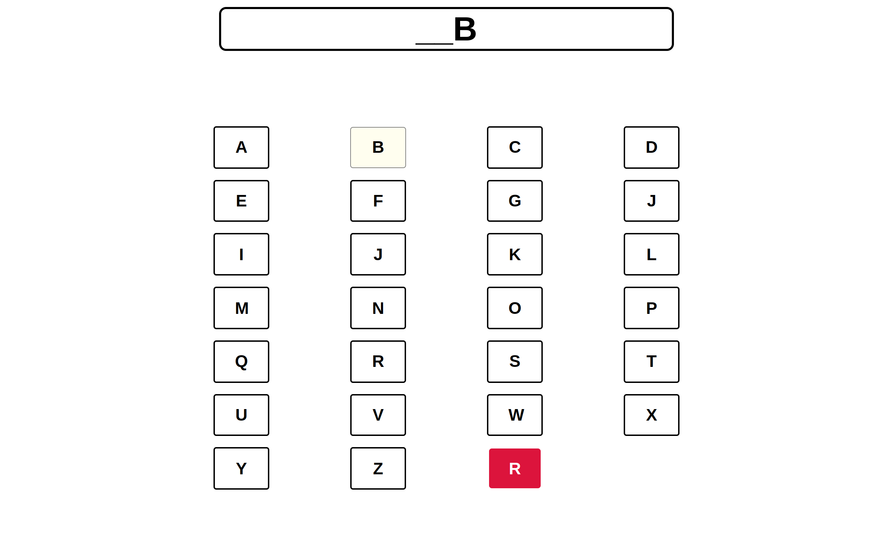

# Interactive Alphabets.

An Interactive tile application that provide functionality based on interaction and rules.

## The Application have to full-fill following criteria.

1. Tile Rendering.(grid/container)
2. Click Interaction. (shows output on a html element with id `outputString`)
3. Consecutive latter replacement(when same char repeated 3 times then it will be replaced by "_").

## Output

### Initial State

### When we input (A B C F F F G)

### When we input (A 6 times followed by B)

